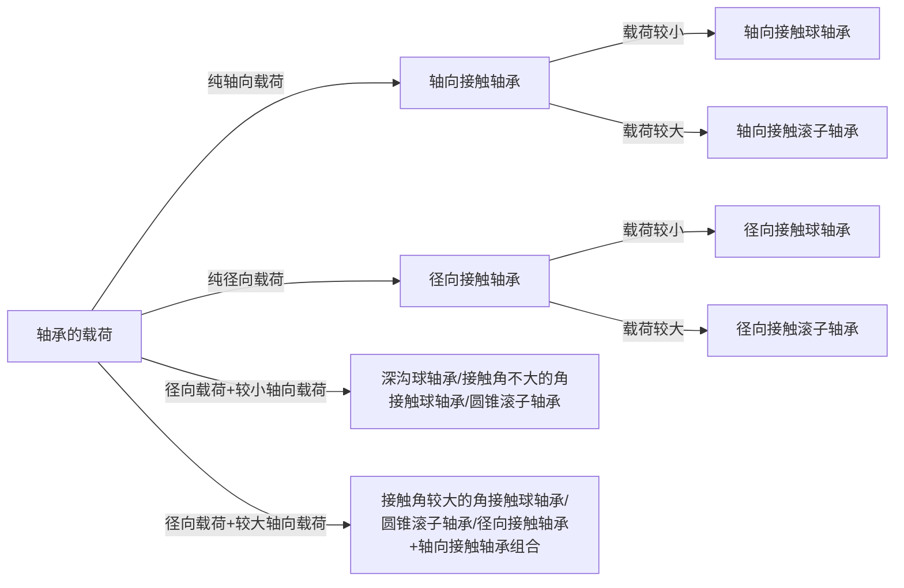

# 第十三章 滚动轴承

## 13-1 概述

基本结构：

- 内圈
- 外圈
- 滚动体
- 保持架

常用材料：GCr15

## 13-2 滚动轴承的主要类型及其代号

### 滚动轴承的主要类型、性能与特点

向心轴承：主要用于承受径向载荷 $$F_r$$ 的轴承

推力轴承：主要用于承受轴向载荷 $$F_a$$ 的轴承

接触角 $$\alpha$$：轴承的滚动体与外圈滚道接触点（线）处的法线 $$N-N$$ 与径向的夹角 $$\alpha$$

载荷角 $$\beta$$ ：角接触向心（推力）轴承实际所承受的径向载荷 $$F_r$$ 与轴向载荷 $$F_a$$ 的合力与径向的夹角 $$\beta$$

### 滚动轴承的代号

[GB/T 272-2017 滚动轴承 代号方法](https://muzing-bucket0.oss-cn-huhehaote.aliyuncs.com/documents/GBT-272-2017.pdf)

#### 基本代号

TODO

#### 后置代号

表示轴承的结构、公差及材料的特殊要求等，用字母和数字表示

TODO

#### 前置代号

用于表示轴承的分部件，用字母表示

#### 代号举例

`6308`：内径为 40 mm 的深沟球轴承，尺寸系列 03，普通级公差，N 组游隙

`7211C`：内径为 55 mm 的角接触球轴承，尺寸系列 02，接触角 15°，普通级公差，N 组游隙

`N408/P5`：内径为 40 mm 的外圈无挡边圆柱滚子轴承，尺寸系列 04，5 级公差， N 组游隙

## 13-3 滚动轴承类型的选择

### 轴承的载荷

轴承所受载荷的大小、方向和性质，是选择轴承类型的主要依据

### 轴承的转速

**极限转速** $$n_\lim$$ ：

载荷不太大（当量动载荷 $$P \leq 0.1 C$$，$$C$$ 为基本额定动载荷），冷却条件正常，且为普通级公差轴承时的最大允许转速

1. 在高速时应优先选用球轴承（与滚子轴承相比，有较高的极限转速）
2. 在高速时宜选用相同内径而外径较小的轴承。若用一个外径较小的轴承承载能力不足，则可再并装一个相同的轴承，或者考虑采用宽系列的轴承。
3. 保持架的材料与结构对轴承转速影响极大。青铜保持架允许更高的转速，实体保持架比冲压保持架允许高一些的转速
4. 轴向接触轴承的极限转速均很低。工作转速高，轴向载荷不十分大的场合可以用角接触球轴承承受纯轴向力
5. 改善轴承的高速性能（工作转速略超过样本中规定的极限转速时可用）：
   - 选用较高公差等级的轴承
   - 选用较大游隙的轴承
   - 循环润滑或油雾润滑
   - 加强对循环油的冷却
6. 若工作转速超过极限转速较多，则应选用特制的高速滚动轴承（见本章第 7 节）

### 轴承的调心性能

需要使用调心轴承的场景：当轴的中心线与轴承座孔的中心线不重合而有角度误差时，或因轴受力而弯曲或倾斜时，会造成轴承的内、外圈轴线发生偏移

滚子轴承对轴承的偏斜最为敏感。在轴的刚度和轴承座孔的支承刚度较低时，或有较大偏转力矩作用时，应尽量避免使用滚子轴承

### 轴承的安装和拆卸

轴承座没有刨分面而必须沿轴向安装和拆卸轴承部件时，应优先选用内、外圈可分离的轴承

当轴承在长轴上安装时，为了便于装拆，可以选用其内圈孔为 1 : 12 的圆锥孔（用以安装在紧定衬套上）的轴承

## 13-4 滚动轴承的工作情况

### 轴承工作时轴承元件上的载荷分布

变形协调条件：假设内、外圈除了与滚动体接触处共同产生的局部接触变形外，它们的几何形状并不改变

承载区：各滚动体从开始受载到受载终止所对应的区域

### 轴承工作时轴承元件上的载荷变化及应力的变化

对滚动体上某一点，其载荷及应力为周期性地不稳定变化（a）

对于固定套圈上每一个具体的点，承受稳定的脉动循环载荷的作用（b）

### 轴向载荷对载荷分布的影响

派生轴向力 $$F_d$$ （内部轴向力）

平衡派生轴向力 $$F_d$$ 所需要施加的轴向力 $$F_a$$ 为

$$
F_a = F_d > F_r \tan \alpha
$$

角接触球轴承及圆锥滚子轴承总是在径向力 $$F_r$$ 和轴向力 $$F_a$$ 的联合作用下工作

为使较多的滚动体同时受载，应使 $$F_a$$ 比 $$F_r \tan \alpha$$ 大一些

## 13-5 滚动轴承尺寸的选择

### 滚动轴承的失效形式及基本额定寿命

**滚动轴承正常失效形式**：内、外圈滚道或滚动体上的点蚀破坏

**轴承的寿命**：单个轴承，其中一个套圈或滚动体首次出现疲劳点蚀之前，一套圈相对于另一套圈的转数

**基本额定寿命** $$L_{10}$$ ：一组在相同条件下运转的近于相同的轴承，将其可靠度为 90% 时的寿命作为标准寿命，即按一组轴承中 10% 的轴承发生点蚀破坏，而 90% 的轴承不发生点蚀破坏前的转速（以 $$10^6$$ 转为单位）或工作小时数作为轴承的寿命

预期计算寿命：设计机器时所要求的轴承寿命，通常可参照机器的大修期限取定，参考值查表

滚动轴承非正常失效形式：（可认为是事故）

- 润滑油不足使轴承烧伤
- 润滑油不清洁而使滚动体和滚道过度磨损
- 装配不当使轴承卡死、胀破内圈、挤碎内外圈和保持架等

### 滚动轴承的基本额定动载荷

**基本额定动载荷** $$C$$ ：使轴承的基本额定寿命恰好为 $$10^6$$r （转）时轴承所能承受的载荷

| 轴承类型                   | 具体含义                               | 符号表示 |
| -------------------------- | -------------------------------------- | -------- |
| 径向接触轴承               | 纯径向载荷（径向基本额定动载荷）       | $$C_r$$  |
| 轴向接触轴承               | 纯轴向载荷（轴向基本额定动载荷）       | $$C_a$$  |
| 角接触球轴承、圆锥滚子轴承 | 使套圈间产生纯径向位移的载荷的径向分量 | -        |

### 滚动轴承寿命的计算公式

$$
L_{10} = \Big( \frac{f_t C}{P} \Big)^\varepsilon
$$

对于球轴承，$$\varepsilon = 3$$ ；对于滚子轴承，$$\varepsilon = \frac{10}{3}$$

$$
L_h = \frac{10^6}{60 n} \Big( \frac{f_t C}{P} \Big)^\varepsilon
$$

$$
C = \frac{P}{f_t} \sqrt[^\varepsilon]{\frac{60 n L_h^\prime}{10^6}}
$$

### 滚动轴承的当量动载荷

一般公式：

$$
P = X F_r + Y F_a
$$

实际计算式：

$$
P = f_d (X F_r + Y F_a)
$$

$$
P = f_d F_r
$$

$$
P = f_d F_a
$$

$$f_d$$ ：载荷系数，值查表

### 角接触球轴承和圆锥滚子轴承的径向载荷 $$F_r$$ 与轴向载荷 $$F_a$$ 的计算

1. 通过派生轴向力及外加轴向载荷的计算与分析，判定被“放松”或被“压紧”的轴承
2. 确定被“放松”轴承的轴向力仅为其本身派生的轴向力，被“压紧”轴承的轴向力为除去本身派生的轴向力外其余各轴向力的代数和

轴承的压力中心：轴承反力的径向分力在轴心线上的作用点

### 不稳定载荷和不稳定转速时轴承的寿命计算

不稳定变应力时的疲劳损伤累计理论

$$
L_h = \frac{10^6}{60 n_m} \Big( \frac{C}{P_m} \Big)^\varepsilon
$$

### 滚动轴承的静载荷

对于某些在工作载荷下基本不旋转，或缓慢摆动、转速极低的轴承，主要失效形式不再是点蚀，而是**塑性变形**。故应按轴承的静强度来选择轴承的尺寸

**基本额定静载荷**（$$C_0$$）：

使受载最大的滚动体与滚道接触中心处产生总永久变形量约为滚动体直径的万分之一时的载荷

**当量静载荷 $$P_0$$**：

将轴承上作用的径向载荷 $$F_r$$ 和轴向载荷 $$F_a$$ 折合而成

$$
P_0 = X_0 F_r + Y_0 F_a
$$

$$X_0$$ $$Y_0$$ 分别为当量静载荷的径向载荷系数、轴向载荷系数，其值可查轴承手册

**轴承静强度安全系数** $$S_0$$ ：
$$
S_0  = \frac{C_0}{P_0} \geq [S_0]
$$

| 使用情况                                           | $$S_0$$    | 原因                                             |
| -------------------------------------------------- | ---------- | ------------------------------------------------ |
| 要求轴承转动很平稳                                 | $$>1$$     | 尽量避免轴承滚动表面的局部塑形变形量过大         |
| 对轴承转动平稳要求不高，无冲击载荷，或仅作摆动运动 | $$\leq 1$$ | 尽量使轴承在保证正常运行条件下发挥最大的静载能力 |

$$S_0$$ 的选择可参考：[GB/T 4662-2012 滚动轴承 额定静载荷](https://muzing-bucket0.oss-cn-huhehaote.aliyuncs.com/documents/GBT-4662-2012.pdf)

### 不同可靠度时滚动轴承寿命的计算

可靠度修正系数 $$a_1$$

修正额定寿命 $$L_{n \mathrm{m}}$$：

$$
L_{n \mathrm{m}} = a_1 L_{10}
$$

| 字母符号             | 含义                                                         |
| -------------------- | ------------------------------------------------------------ |
| $$L_{n \mathrm{m}}$$ | 可靠度 $$R = (100-n)\%$$ （破坏概率为 $$n \%$$）时的寿命，即修正额定寿命 |
| $$a_1$$              | 可靠度寿命修正系数，查表                                     |

$$
L_{n \mathrm{m}} = \frac{10^6 a_a}{60 n} \Big( \frac{C}{P} \Big)^{\varepsilon}
$$

## 13-6 轴承装置的设计

### 支撑部分的刚性和同心度

**刚性**：

- 轴和安装轴承的外壳或轴承座，以及轴承装置中的其他受力零件必须有足够的刚度，因为这些零件的变形都要阻滞滚动体的滚动而使轴承提前损坏
- 外壳及轴承座孔壁均应有足够的厚度
- 外壳上的轴承座的悬臂应尽可能地缩短，并用肋板来增强支承部位的刚性
- 若外壳是用轻合金或非金属制成的，安装轴承处则应采用钢或铸铁制成的套杯

**同心**：

- 采用整体结构的外壳，并把安装轴承的两个孔一次镗出
- 若轴承尺寸难以相同，外壳上的轴承孔仍应一次镗出，可利用衬筒来安装尺寸较小的轴承
- 当两个轴承孔分在两个外壳上时，应把两个外壳组合在一起进行镗孔

### 滚动轴承的轴向定位与紧固

内圈紧固常用方法：

| 方法                       | 适用场合                                           |
| -------------------------- | -------------------------------------------------- |
| 轴用弹性挡圈嵌在轴的沟槽内 | 轴向力不大，转速不高                               |
| 螺钉固定的轴端挡圈紧固     | 高转速下承受大的轴向力                             |
| 圆螺母和止动垫圈紧固       | 轴承转速高、承受较大的轴向力                       |
| 紧定衬套、止动垫圈、圆螺母 | 光轴上的、轴向力和转速都不大的、内圈为圆锥孔的轴承 |

外圈轴向定位与紧固的常用方法：

| 方法                                                | 适用场合                                                     |
| --------------------------------------------------- | ------------------------------------------------------------ |
| 外壳孔内的凸肩定位+嵌入外壳沟槽内的孔用弹性挡圈紧固 | 轴向力不大且需减小轴承装置的尺寸时                           |
| 嵌入轴承外圈止动槽内的轴用弹性挡圈定位+轴承端盖紧固 | 带有止动槽的深沟球轴承，当外壳不便设凸肩或外壳为剖分式结构时 |
| 轴承端盖紧固                                        | 高转速及很大的向心力时的各类向心、推力和向心推力轴承         |
| 螺纹环紧固                                          | 轴承转速高、轴向载荷大，而不便于使用轴承端盖紧固的情况       |

### 轴承的配置

合理的轴承配置应考虑轴在机器中有正确的位置、防止轴向窜动、轴受热膨胀后不致将轴承卡死等因素

#### 双支点 各单向固定

常用两个反向安装的角接触球轴承或圆锥滚子轴承，两个轴承各限制轴在一个方向的轴向移动

#### 一支点双向固定，另一端支点游动

适用场景：跨距较大且温度较高的轴

#### 两端游动轴承

对于一对人字齿轮轴，由于人字齿轮本身的相互轴向限位作用，它们的轴承内、外圈的轴向定位与紧固应设计成只保证其中一根轴相对机座有固定的轴向位置，而另一根轴上的两个轴承都必须是游动的，以防齿轮卡死或人字齿轮的两侧受力不均匀

### 轴承游隙及轴上零件位置的调整

### 滚动轴承的配合

基本原则：保证轴承正常运转，防止内圈与轴、外圈与外壳孔在工作时发生相对转动

### 滚动轴承的预紧

**预紧概念**：在安装时用某种方法在轴承中产生并保持一轴向力，以消除轴承中的轴向游隙，并在滚动体和内、外圈接触处产生初变形

**预紧作用**：

- 提高轴承的旋转精度
- 增加轴承装置的刚性
- 减小机器工作时轴的振动

**常用预紧措施**：

- 夹紧一对圆锥滚子轴承的外圈
- 用弹簧预紧
- 一对轴承中间装入长度不等的套筒
- 夹紧一对磨窄了的外圈（反装时可磨窄内圈并夹紧）

### 滚动轴承的润滑

**润滑剂作用**：

- 降低摩擦阻力
- 散热
- 减小接触应力
- 吸收振动
- 防止锈蚀

表示轴承的速度大小：$$dn$$ 值（$$d$$ 为滚动轴承内径，mm；$$n$$ 为轴承转速，r/min）

适用于脂润滑和油润滑的 $$dn$$ 值界限：查表

#### 脂润滑

**脂润滑特点**：形成的润滑膜强度高，能承受较大的载荷，不易流失，容易密封，一次加脂可以维持相当长的一段时间

**装脂量**：轴承内部空间的 1/3 ~ 2/3

**锥入度选择**：轴承的 $$dn$$ 值大、载荷小时，应选锥入度较**大**的润滑脂；反之则选用锥入度小的

**温度**：轴承的工作温度低于润滑脂的滴点，矿物油润滑脂低 10 ~ 20 °C，合成润滑脂低 20 ~ 30 °C

#### 油润滑

> 扩展阅读： [SKF-选择合适的润滑油](https://www.skf.com/cn/products/rolling-bearings/principles-of-rolling-bearing-selection/bearing-selection-process/lubrication/selecting-a-suitable-oil)

##### （1）油浴润滑

- 把轴承局部浸入润滑油中
- 当轴承静止时，油面应不高于最低滚动体的中心
- 不适用于高速

某些轴承具有的泵吸作用可使润滑油产生循环： 在图中，球面推力滚子轴承泵送润滑油，然后通过下方连接的油路使油回到推力轴承中

##### （2）滴油润滑

适用于需要定量供应润滑油的轴承部件

常使用黏度较小（粘度等级不高于 15）的润滑油

##### （3）飞溅润滑

一般闭式齿轮传动装置中的轴承常用的润滑方法，利用齿轮的转动把润滑齿轮的油甩到箱体四周壁面上，然后通过适当的沟槽把油引入到轴承中去

##### （4）喷油润滑

##### （5）油雾润滑

适用于轴承滚动体线速度很高（如 $$dn \leq 6 \times 10^5$$ mm · r/min）的情况

油气润滑也叫油点润滑法。用压缩空气将经过精确计量的少量润滑油沿着供油管内壁输送到喷嘴，以油滴状喷到轴承内部进行润滑。 这种最小剂量的润滑方法使得轴承能够以极高转速运行，同时工作温度相对较低。 压缩空气还能冷却轴承，并防止粉尘和腐蚀性气体侵入。

##### （6）循环油润滑

通过外接的油泵而不是油池实现油循环，主要用于需要带走由轴承和/或其他热源产生的热量的应用场合

简单的循环油系统包括：

- 油泵
- 过滤器
- 油箱
- 润滑油冷却和/或加热系统

#### 固体润滑

**常用固体润滑方法**：

1. 用黏结剂将固体润滑剂黏结在滚道和保持架上
2. 把固体润滑剂加入工程塑料和粉末冶金材料中，制成有自润滑性能的轴承零件
3. 用电镀、高频溅射、离子镀层、化学沉积等技术使固体润滑剂或软金属（金、银、铟、铅等）在轴承零件摩擦表面形成一层均匀致密的薄膜

**最常用的固体润滑剂**：

- 二硫化钼
- 石墨
- 聚四氟乙烯

### 滚动轴承的密封装置

#### 接触式密封

1. 毡圈油封
2. 唇形密封圈
3. 密封环

#### 非接触式密封

1. 隙缝密封
2. 甩油密封
3. 曲路密封

## 13-7 其他

### 高速滚动轴承简介

### 高温滚动轴承简介

### 滚动轴承与滑动轴承的比较
